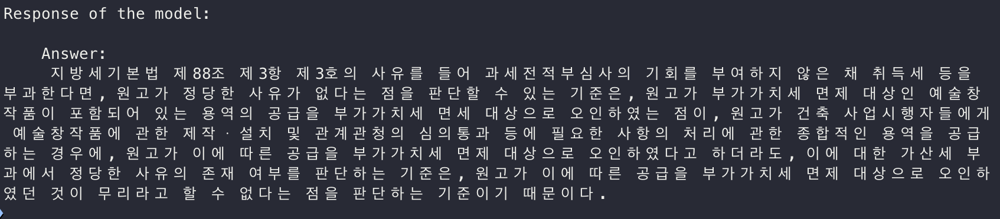

## Cache-Augmented Generaton

### RAG 의 한계:
1. 실시간 검색은 시스템의 지연을 초래하여 사용자 경험을 저하시킬 수 있다.
2. 검색 단계에서 부정확하거나 관련 없는 문서를 선택하면 모델의 응답 품질이 크게 저하된다.
3. 검색 및 생성 모듈을 통합해야 하는 시스템 구조는 복잡성을 증가시키며, 이를 유지하고 최적화하는 데 추가적인 노력이 필요하다

----

### CAG 방법론 제안:
1) 대규모 언어 모델의 확장된 컨텍스트 윈도우를 활용하여 외부 데이터를 사전에 로드
2) 키-값(Key-Value, KV) 캐시를 생성하여 실시간 검색 단계를 완전히 제거

-> 시스템의 지연을 최소화 및 검색 오류 방지, 구조적 단순성 확보
-> CAG 가 RAG 대비, 효율성과 정확성에서 우수함을 입증

----
### CAG 기법 소개


### ACTION:
1. 지식 사전 로딩(Preloading External Knowledge)
- 데이터 수집 및 전처리:
    - 작업에 필요한 문서 수집
    - 모델의 컨텍스트 윈도우에 맞게 문서의 크기 조정(ex. 중복 제거, 불필요한 정보 삭제, 문서 압축 등)
- 모델 입력 구성:
    사전 로딩된 문서 + 사용자 질의를 통합하여 모델의 입력으로 사용
- 효율적인 데이터 관리:
    - 특정 작업에 필요한 도메인 지식만 로드하여 메모리 사용량을 최적화

2. KV 캐시(Key-Value Cache) 생성
- 사전 로드한 지식을 바탕으로 KV 캐시 생성
- 캐시된 것은 디스크나 메모리에 저장

3. CAG 의 추론(Inference) 과정
CAG 의 추론 단계는 사전 계산된 KV 캐시와 사용자의 질의를 결합하여 응답을 생성함.

이때, KV 캐시가 포함된 입력은 모델의 컨텍스트 윈도우에 로드되어 모델은 사전 로딩된 문서와 사용자 질의를 통합적으로 이해하여 높은 품질의 응답을 생성.

하지만, 여러번의 추론이 진행됨에  따라 캐시는 점점 커지므로, 이를 효율적으로 관리하기 위해 캐시 초기화 단계가 필요.

캐시를 초기화하거나, 불필요한 토큰을 제거하여 캐시 크기를 줄이는 작업이 필요.

### CAG 실험 및 성능 평가
1. SQuAD 데이터셋, HotPotQA 데이터셋을 사용
2. 문서 크기에 따라 Small, Medium, Large 로 3가지 범주로 나누어 진행하였으며 실험 결과는 정확도와 속도의 2가지 기준으로 측정함

cf. 
- SQuAD 데이터셋: 단일 문맥 내에서 질문에 대한 명확한 답변을 생성하는 데이터셋
- HotPotQA 데이터셋: 여러 문서를 통합하여 복합적인 질문에 답변하는 데이터셋


---
### 4. 테스트 결과
#### 실행 커맨드
```bash
python cache_augmented_generation.py \
  -m meta-llama/Llama-3.2-1B-Instruct \
  -k /Users/namhyeonsu/Desktop/TIL/rags/paper/knowledge.txt \
  -q "지방세기본법 제88조 제1항이 궁금해"
```
#### 테스트 이미지
